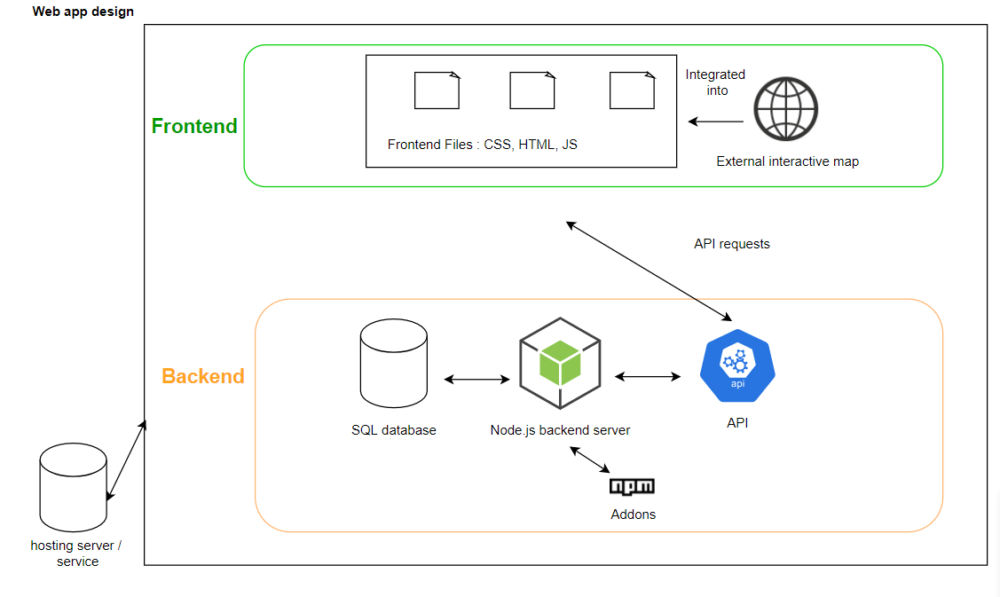

# GeoPlay
<h3 align="center">GeoPlay Synopsis</h3>

Secure Coding Course, using ngrok at the moment for webhook detection with Jenkins!
## Table of Contents

* [Synthesis](#synthesis)
* [Conception](#conception)
* [Roadmap](#roadmap)
* [Objectives of the initial prototype](#objectives-of-the-initial-prototype)
* [Authors](#authors)

## Synthesis

Our web-application is going to be a geographical game in which a player has to localize a given place on an interactive map. If the result is the one expected the player earns points. All the results will be added to a database, enabling players to compare their scores between themselves. In the later stage of development, we would like to have a multiplayer mode where players could play at the same time on the same map in competition with one another.

This interactive game would have multiple objectives:
* Integration an interactive map in the graphical 
* Creating the system of the game (score, interactions, logic)
* Deploying the website online
* Set up the database
* Set up the API (to access data)

The collaborative tools used are :
* Teams (instant messaging)
* JIRA (project management)
* GIT (code sharing)

## Conception

It is a project that is very oriented towards the backend. That’s why we chose to use an external interactive map to lighten our workload on the frontend. 

We think the best approach is to first focus on the backend, because it represents most of the work to be done. We for example have to conceive our database, set up our apis and also the authentication.

We will then progressively upgrade our api, as the project will gain some functionalities

In terms of technological choices, we plan on using a SQL database, a modern frontend framework with node.js. Those choices will be confirmed during our first sprint. 

In concrete terms:
Ideally, we would have the following types of web pages:
* Authentication page: where the user will sign in or sign up
* Menu page: where all quizz series are displayed so the player can choose which one he is willing to try
* Quizz description page: where the details about a quizz is displayed (difficulty level, scores…)
* Quizz: where the user play

Of course, this is a prototype liable to change if we realized some other options are more appropriate or convenient.

## Roadmap

Sprint duration : 1 week

Sprint 1 (november 9):
  * Technological choices
  * Creation of the database (and a test data set)
  * Set up of the API (basis: users)
  * Beginning of the authentication feature
  * Front-end skeleton (ex: authentication page)
  * Searching how the [vue-svg-map](https://github.com/VictorCazanave/vue-svg-map) project works, and how to use/integrate it to our project
  
Sprint 2 (november 16):
* Interactive map integration
* Implementation of the basic game logic
* Improvement of the front-end
* Improvement of the API
* Complete the database (with the quizz series structure)

Sprint 3 (november 23):
* New feature: creation of quiz series by users
* Improvement of the Front-end
* Improvement of the API

Sprint 4 (november 30): 
* Start of the multiplayer game feature(s)
* Improvement of the existing features (test, bug fix, enhancement)

Sprint 5 (december 7): 
* End of the multiplayer game
* Online deployment of the website
* Bonus features if enough time (survival mode)
* Final testing

There will be a meeting with the whole team at the end of each sprint to recap what we did (if it corresponds to our original planning or not) and to discuss what we will do during the next sprint. 

## Objectives of the initial prototype

<ins>Detailed features and user interaction:</ins>

The initial prototype would have the following features:
* Functional game with a unique map/quiz 
* Simple and clear user interface 
* Basic score system 
* Basic API 

For a typical use case: a user connects to the website and arrives on the home page containing a list of quizz series. Then, he can choose to start the quizz or get information about it.
The quiz starts and displays the name of a place (ex: a country name) that the player has to locate on the map.
Each correct answer increases the score of the player.

When the game is finished, the result page is displayed.
The user can then go back to the main menu.

## Authors

* **François Gillioen** - [frankfg94](https://github.com/frankfg94)
* **Marc Guiochau** - [Doratik](https://github.com/Doratik)
* **Nicolas Guibert** - [GuibertNicolas](https://github.com/GuibertNicolas)
* **Marine Chauveau** - [MarineCB](https://github.com/MarineCB)
